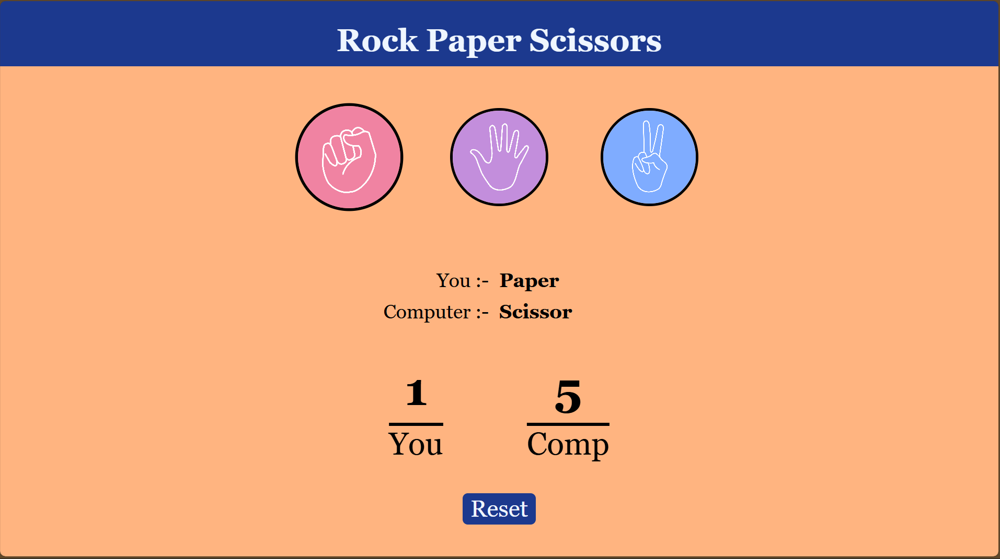

# Stone Paper Scissor Web Game

A classic game of Stone, Paper, Scissor built with HTML, TailwindCSS, and JavaScript. This project is a fun, interactive web-based game where you can test your luck against the computer. The application is fully responsive and provides a seamless experience on all devices, from desktops to mobile phones.

**Live Demo:** [**Play the Game Here!**](https://aayush-2103.github.io/Stone_Paper_Scissor_web/)




---

## 🚀 About The Project

This project was created to demonstrate fundamental web development skills using plain HTML, TailwindCSS, and JavaScript. It's a simple yet engaging game that follows the traditional rules of Stone, Paper, Scissor. The user interface is designed to be intuitive and user-friendly, with clear visual feedback for game outcomes.

---

## ✨ Features

* **Interactive Gameplay:** Play against a computer opponent that makes a random choice.
* **Score Tracking:** Keep track of your score and the computer's score during the session.
* **Responsive Design:** Enjoy a flawless experience on any device, including desktops, tablets, and smartphones.
* **Visual Feedback:** Clear indicators for win, lose, or draw outcomes.
* **Simple & Clean UI:** A minimalist design that is easy to navigate and play.
* **Zero Dependencies:** Built with just Vanilla HTML, CSS, and JavaScript. No frameworks or libraries needed.

---

## 🛠️ Technologies Used

* **HTML5:** For the structure and content of the game.
* **TailwindCSS:** For styling the user interface and ensuring responsiveness.
* **JavaScript:** For the game logic, event handling, and DOM manipulation.

---

## 🎮 How To Play

1.  **Open the live demo link** in your web browser.
2.  Click on one of the three choices: **Stone**, **Paper**, or **Scissor**.
3.  The computer will make its choice.
4.  The winner of the round is displayed, and the scores are updated.
5.  Continue playing as many rounds as you like!

**Game Rules:**
* Stone beats Scissor
* Scissor beats Paper
* Paper beats Stone

---

## 🏁 Getting Started

To get a local copy up and running, follow these simple steps.

### Prerequisites

You only need a modern web browser to run this project.

### Installation

1.  Clone the repository:
    ```sh
    git clone "https://github.com/Aayush-2103/Stone_Paper_Scissor_web.git"
    ```
2.  Navigate to the project directory:
    ```sh
    cd Stone_Paper_Scissor_web
    ```
3.  Open the `index.html` file in your web browser.
    * You can do this by double-clicking the file in your file explorer or by right-clicking and selecting "Open with" your preferred browser.

---

## 📄 License

Distributed under the MIT License. See `LICENSE` for more information.
